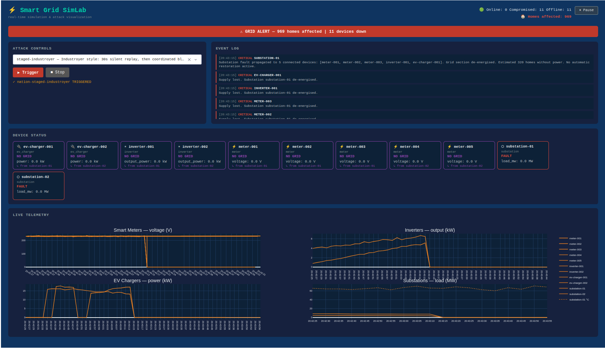

# Smart Grid SimLab



A demo and visualisation tool for showing the real-world consequences of cyber-attacks on
smart grid infrastructure. Built for security awareness presentations, internal demos, and
boardroom-level explanations of OT/ICS threats.

This is not a red team platform or CTF environment. It simulates synthetic telemetry and injects
attack effects locally. No real devices, protocols, or networks are involved.

## What it does

Runs a synthetic smart grid — smart meters, solar inverters, EV chargers, substations — publishing
live telemetry over MQTT. An attack engine intercepts that telemetry and applies configurable attack
effects. A real-time dashboard shows the consequences.

The point: make abstract attack categories visible and tangible to a non-technical audience.

```
Simulator → MQTT broker → Attack Engine → shadow topics → Dashboard
```

## Attacks included

Hover over any attack in the dropdown to see a real-world incident description.

### Basic techniques

| Attack               | Effect on dashboard                                                      |
|----------------------|--------------------------------------------------------------------------|
| Telemetry spoofing   | Voltage readings spike or collapse on meter charts                       |
| Device shutdown      | Device card turns red, power drops to zero                               |
| Demand spike         | Load readings multiply — triggers overload alarms                        |
| Frequency attack     | Grid frequency drifts outside the 49–51 Hz safe band                     |
| Cascading failure    | Substation faults, all connected devices lose grid, homes counter spikes |
| Modbus write         | Control register overwritten — load setpoint zeroed                      |
| Replay / data freeze | Device appears frozen — stale readings mask real state                   |

### Nation-state scenarios

Each scenario is modelled on a real documented incident or malware family.

| Scenario                     | Based on                                                 |
|------------------------------|----------------------------------------------------------|
| Coordinated blackout         | Ukraine 2015 — Sandworm / GRU                            |
| Staged industroyer           | Industroyer 2016, Industroyer2 2022 — Sandworm           |
| Slow burn                    | Spoofing-then-overload, documented ICS intrusion pattern |
| Relay bypass                 | Industroyer / Crashoverride protection relay override    |
| Safety bypass                | Triton / TRISIS safety system attack                     |
| Wiper                        | Industroyer2 + CaddyWiper anti-forensics                 |
| Transformer overheating      | Stuxnet 2010 — Iran Natanz                               |
| Silent dwell + blackout      | Volt Typhoon 2023 — Chinese APT                          |
| Modbus heating attack        | FrostyGoop 2024 — Lviv, Ukraine                          |
| ICS framework                | PIPEDREAM / INCONTROLLER 2022                            |
| Ransomware shutdown          | Colonial Pipeline 2021                                   |
| Out-of-phase breaker cycling | Aurora vulnerability 2007 — Idaho National Laboratory    |
| Steel mill sabotage          | Predatory Sparrow 2022 — Iran                            |
| SIS kill chain               | Triton / TRISIS full kill chain 2017 — Saudi Arabia      |

## Architecture

```
smart-grid-simlab/
├── simulator/        # Device simulator (paho-mqtt, one thread per device)
│   └── devices/      # SmartMeter, SolarInverter, EVCharger, Substation
├── attacks/          # Attack engine (aiomqtt transparent MQTT proxy)
├── dashboard/        # Flask + Plotly Dash 2.x real-time dashboard
├── config/           # devices.yaml, attacks.yaml
├── broker/           # Mosquitto config
├── tests/            # pytest unit and integration tests
└── docker-compose.yml
```

Topic flow:

```
devices/<type>/<id>/state          ← simulator publishes here
shadow/devices/<type>/<id>/state   ← attack engine republishes (modified or pass-through)
control/attacks/<id>               ← dashboard triggers attacks here
events/alarms                      ← attack engine publishes SCADA-style alarm events
```

The attack engine always republishes all device telemetry to `shadow/` topics, so the dashboard
always has live data regardless of whether any attack is active.

## Running it

Requirements: Docker, Python 3.11+

```bash
# 1. Start MQTT broker
docker compose up -d broker

# 2. Install Python deps
pip install -r requirements.txt

# 3. Start device simulator (background)
python -m simulator.main &

# 4. Start attack engine
python -m attacks.engine &

# 5. Start dashboard
python -m dashboard.app
# → http://localhost:8050
```

Or run everything in Docker:

```bash
docker compose up --build
```

### Triggering attacks

From the dashboard: select an attack from the dropdown and click Trigger. Hover over any entry
in the dropdown for a description of the real-world incident it is based on.

Via REST (for scripted demos):

```bash
curl -s -X POST http://localhost:8050/attack/trigger \
  -H "Content-Type: application/json" \
  -d '{"attack_id": "cascade-substation-01"}'
```

Via MQTT directly:

```bash
mosquitto_pub -t control/attacks/cascade-substation-01 \
  -m '{"action": "trigger", "attack_id": "cascade-substation-01"}'
```

The Pause button in the top-right corner freezes the dashboard mid-demo — useful when you want to
discuss what is on screen without data racing by.

## Configuration

`config/devices.yaml` — devices, types, update rates, topology (which substation each device
connects to), and vulnerability classes.

`config/attacks.yaml` — named attacks with targets, parameters, and a short `info` field used
as the dropdown tooltip. Add new entries here; the engine and dashboard pick them up on restart.

## Documentation

- `attacks/attacks.md` — each attack explained from a red-team / incident perspective
- `simulator/devices/devices.md` — device types, topology, and status indicators
- `dashboard/dashboard.md` — what each attack looks like on the dashboard

## Testing

```bash
pip install -r requirements-dev.txt
pytest
```

89% coverage across simulator, attack engine, and dashboard MQTT client. See `pyproject.toml`
for pytest configuration.

## What it is not

- Not a real ICS simulator (no GridLAB-D, no actual Modbus/DNP3 on the wire)
- Not a red team platform (no exploitable services, no flag system, no scoring)
- Not academically accurate (synthetic telemetry, not physics-based)
- Not a CTF environment (no per-team isolation, no challenge progression)

## Licence and usage

This project is licensed under the [Polyform Noncommercial Licence](LICENCE).

Free to use for:

- Learning and personal experimentation
- Academic research, coursework, and dissertations
- Classroom and curriculum use by educators
- Non-commercial workshops, civic exercises, and community events

See [RESEARCH-EXCEPTION.md](RESEARCH-EXCEPTION.md) for the full academic exception.

A [commercial licence](COMMERCIAL-LICENCE.md) is required for paid workshops, training courses,
or commercial product development. All proceeds beyond maintenance costs are donated to
Alzheimer's organisations in memory of [Terry Pratchett](https://terrypratchett.com/).

See [DISCLAIMER.md](DISCLAIMER.md) for what this simulation can and cannot do.
